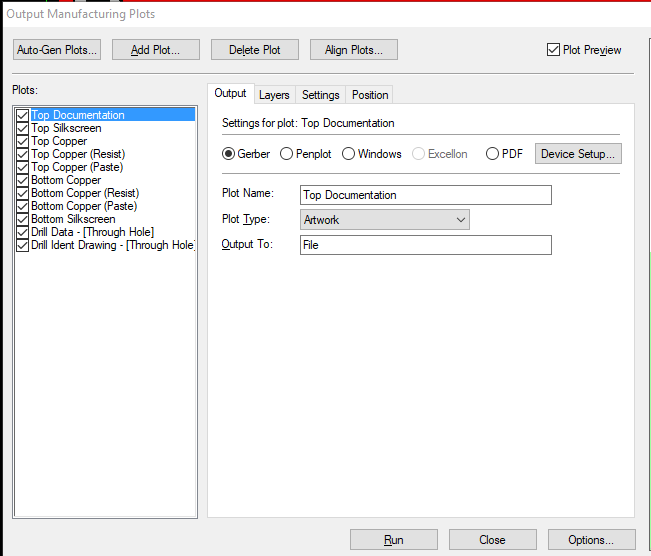
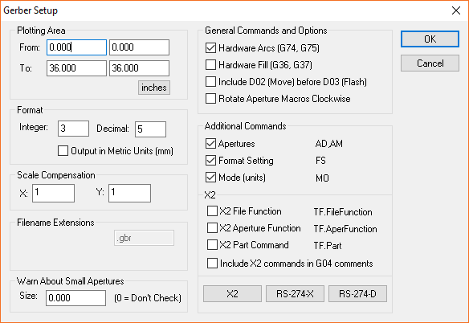
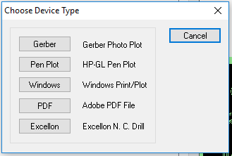
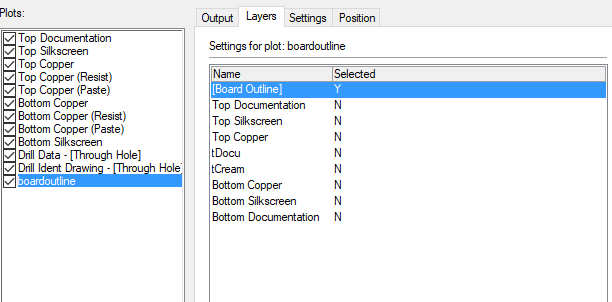
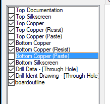
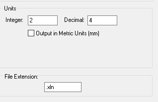
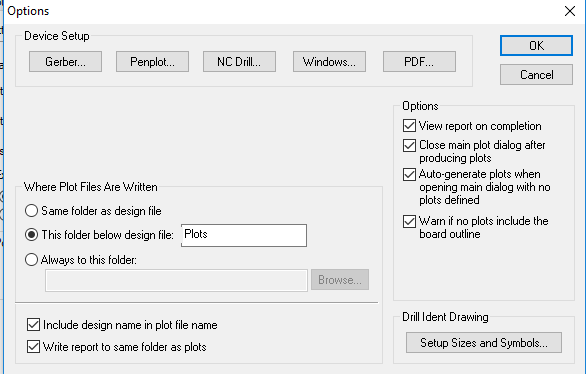
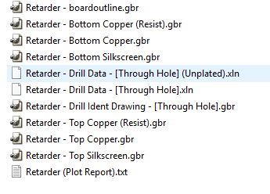
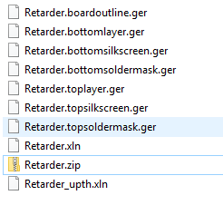

# Using DesignSpark with AISLER

In DesignSpark's PCB view, select the Menu item:

**Output -> Manufacturing Plots** or Shift+P

Click Device Setup

This sets the General Commands and Options, click **OK**

Now click Add Plot...

Click Gerber

This will add a new Plot (Plot 1) in the **Plots:** List.

Change the Plot Name to boardoutline, click the Layers tab, double click the **[Board Outline]** line to change the option to Y

In the Plots: list deselect:

- Top Documentation
- Top Copper (Paste)
- Bottom Copper (Paste)

There are some issues with the drill settings in the Gerbers

Check that the **Plot From:** and **Plot To:** values match those in 'boardoutline'.

Change the **Offset By:** values to 0.0000 and 0.0000

Click the **Options...** button

Then click the **NC Drill...** button

Set the **Integer:** value to 2 and the **Decimal:** value to 4

Finally click **Run** - this will start the export.

## Now the arduous part...
Navigate to the directory that the plots have been saved to

And rename the files to the AISLER expected format 

AISLER expects the gerber files in the following format:

<table>
<tr><th>Gerber Layer Name</th><th>Layer</th></tr>
<tr> <td>project_name.toplayer.ger</td><td>Top Layer</td> </tr>
<tr> <td>project_name.bottomlayer.ger</td><td>Bottom Layer</td> </tr>
<tr> <td>project_name.topsoldermask.ger</td><td>Top Soldermask</td> </tr>
<tr> <td>project_name.bottomsoldermask.ger</td><td>Bottom Soldermask</td> </tr>
<tr> <td>project_name.topsilkscreen.ger</td><td>Top Silkscreen</td> </tr>
<tr> <td>project_name.bottomsilkscreen.ger</td><td>Bottom Silkscreen</td> </tr>
<tr> <td>project_name.boardoutline.ger</td><td>Board Outline</td> </tr>
<tr> <td>project_name.xln</td><td>PTH Drills</td> </tr>
<tr> <td>project_name_npth.xln</td><td>NPTH Holes</td> </tr>
</table>

Once renamed, zip up the files:

Now go to AISLER and [start a new project](https://go.aisler.net/p/new)
